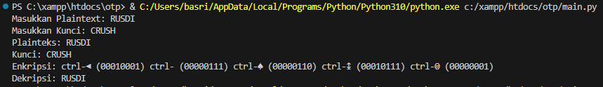
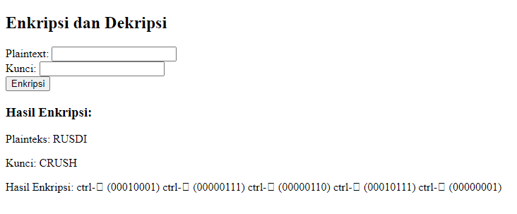

# Kriptografi-10
## Enkripsi-One-Time-Pad (OTP)
## Profil
| #               | Biodata           |
| --------------- | ----------------- |
| **Nama**        | Basri Sangaji     |
| **NIM**         | 312110152         |
| **Kelas**       | TI.21.A.1         |
| **Mata Kuliah** | Kriptografi       |
### File main.py
**Outputnya :**

### Penjelasan
Program ini merupakan implementasi dari enkripsi XOR sederhana menggunakan Python. Mari kita lihat beberapa bagian utamanya: 

**1. Fungsi konversiascii(input_string):**
  - Fungsi ini mengonversi setiap karakter dalam string ke nilai ASCII dan menyimpannya dalam bentuk daftar.
    
**2. Fungsi xor_biner(biner1, biner2):**
  - Fungsi ini melakukan operasi XOR antara dua string biner.
    
**3. Fungsi biner_ke_desimal(biner):**
  - Fungsi ini mengonversi string biner ke nilai desimal.
    
**4. Fungsi kodeascii(ascii_code):**
  - Fungsi ini mengonversi nilai ASCII ke karakter.
    
**5. Input dari pengguna:**
  - Meminta pengguna untuk memasukkan plaintext dan kunci.

**6. Konversi Plaintext dan Kunci ke ASCII:**
  - Menggunakan fungsi konversiascii untuk mengonversi plaintext dan kunci ke nilai ASCII.

**7. XOR antara ASCII Plaintext dan ASCII Kunci:**
  - Menggunakan fungsi xor_biner untuk melakukan operasi XOR antara setiap pasangan nilai ASCII dari plaintext dan kunci.

**8. Konversi hasil XOR ke Desimal:**
  - Menggunakan fungsi biner_ke_desimal untuk mengonversi hasil XOR dari biner ke desimal.

**9. Konversi Desimal ke Karakter ASCII:**
  - Menggunakan fungsi kodeascii untuk mengonversi nilai desimal ke karakter ASCII.

**10. Output Enkripsi:**
  - Menampilkan plaintext, kunci, dan hasil enkripsi dalam format yang diminta.

**11. Dekripsi:**
  - Melakukan operasi XOR antara hasil desimal enkripsi dan nilai ASCII kunci untuk mendapatkan hasil dekripsi.

**12. Output Dekripsi:**
  - Menampilkan hasil dekripsi dalam bentuk karakter. 

Secara keseluruhan, program ini adalah implementasi sederhana dari enkripsi dan dekripsi XOR menggunakan nilai ASCII dari plaintext dan kunci.

### File index.php
**Outputnya :**

### Penjelasan
Program PHP ini adalah implementasi enkripsi XOR yang mirip dengan program Python sebelumnya. Mari kita bahas beberapa poin utama:

**1. HTML Structure:**
  - HTML digunakan untuk membuat antarmuka sederhana yang memiliki dua input (plaintext dan kunci) dan tombol "Enkripsi".

**2. PHP Functions:**
  - Terdapat beberapa fungsi PHP yang mirip dengan program Python sebelumnya, seperti konversiAscii, xorBiner, binerKeDesimal, dan kodeAscii.

**3. Form Handling:**
  - Form ini menggunakan metode POST untuk mengirimkan data ke server saat tombol "Enkripsi" ditekan.
  - Data plaintext dan kunci diambil dari formulir menggunakan $_POST.

**4. Enkripsi:**
  - Jika ada data yang diterima dari formulir, program melakukan langkah-langkah yang serupa dengan program Python.
  - Mengonversi plaintext dan kunci ke ASCII menggunakan fungsi konversiAscii.
  - Melakukan operasi XOR antara ASCII plaintext dan ASCII kunci menggunakan fungsi xorBiner.
  - Mengonversi hasil XOR ke desimal menggunakan fungsi binerKeDesimal.

**5. Tampilan Hasil Enkripsi:**
  - Jika hasil enkripsi sudah dihitung, maka ditampilkan di bagian HTML setelah formulir.

**6. Menampilkan Karakter Kontrol:**
  - Ada penanganan khusus untuk karakter ASCII kurang dari 32 (karakter kontrol). Mereka ditampilkan sebagai "ctrl-" diikuti dengan karakter kontrol.

**7. Pesan Kesalahan:**
  - Jika pengguna tidak mengisi baik plaintext maupun kunci, pesan kesalahan ditampilkan.

Secara keseluruhan, program ini memberikan antarmuka sederhana untuk mengenkripsi plaintext dengan kunci menggunakan operasi XOR, dan menampilkan hasil enkripsi dengan mempertahankan tampilan karakter kontrol jika ada.

Ketika kita menampilkan hasil enkripsi, format keluarannya mencakup istilah "ctrl" dan karakter yang dianggap sebagai kontrol ASCII, dengan memanfaatkan nilai desimal dari hasil XOR. Namun, perlu diingat bahwa tidak semua karakter ASCII di bawah 32 dapat terlihat secara visual di layar konsol. Beberapa karakter kontrol mungkin tidak memiliki representasi grafis yang dapat terlihat, membuatnya sulit untuk diidentifikasi saat mencetak ke layar.

Untuk mengatasi hal ini, saya menambahkan nilai biner pada setiap "ctrl" yang pasti disertakannya (dalam bentuk biner) agar huruf dapat terlihat di rumus. Jadi, meskipun beberapa karakter kontrol mungkin tidak terlihat langsung saat dicetak ke layar, penambahan nilai biner ini membantu mempertahankan informasi dan memastikan bahwa hasil enkripsi tetap jelas dan tidak kehilangan makna ketika ditampilkan.

### Terimakasih
